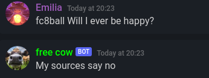
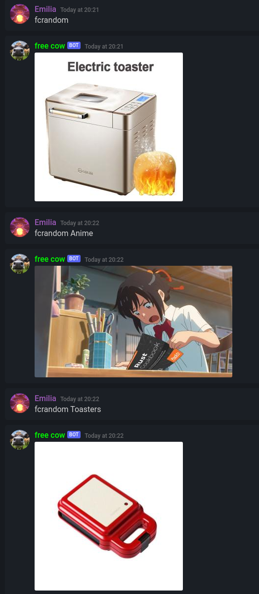
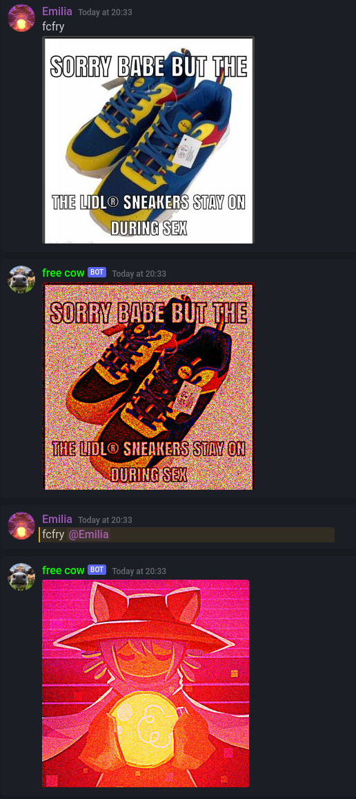

# Scripts for BoneBot
These are scripts made for [BoneBot](https://github.com/jeremynoesen/BoneBot) to show how configurable BoneBot can be.  
Currently there are 3 fun commands added, and an admin command to control permissions.  

## Installation
Clone this repository inside the folder BoneBot runs in, and add these to your commands.txt  

#### 8 ball
Adding this will add an `8ball` command  
`8ball // Play magic 8 ball // $CMD$ BoneBot-Scripts/cmd-8ball.sh $CMD$ $CMDOUT$`  
  

#### Random file
This will return a random file from a folder, with the user being able to specify a subfolder 
`random // Get a random image from a folder // $CMD$ BoneBot-Scripts/cmd-randomfile.sh $CMD$ $FILE$ $CMDOUT$ $FILE$`  
  

###### Going to parent directories (../) is blocked, users with the TRUSTED perm can override this

#### Deepfry
This will deepfry the attached image, avatar of mentioned user or image in referenced message.  
This command requires ImageMagick to be installed, specifically the `convert` command!  
`fry // Absolutely nuke an image (Looping requires permission) // $CMD$ BoneBot-Scripts/cmd-deepfry.sh $CMD$ $CMDOUT$ $FILE$ BoneBot-Scripts/temp/fryout.png $FILE$`  

###### A number can be given to deepfry to loop it several times, this requires the EXTRA perm because this can be resource intensive

### Admin commands

#### Admin
This adds a permissions manager to the commands module.  

The below commands require the ADMIN perm to execute, add your user ID to the `perms/ADMIN` file.  
You can give a user a permission with `!admin addperm PERMNAME @User/<ID>`  
This will store their user ID in a file, which will be checked for if they have access to a command.
To remove a permission from a user, run `!admin rmperm PERMNAME @User/<ID>`  
To list a users permissions, run `!admin perms @User/<ID>`  
To list all existing permissions, run `!admin perms`  
To delete a permission, run `!admin rmperm PERMNAME` without specifying a user.  

The `hasperm.sh` script can be used to check if a user has a permission, you can prepend this to a command like so to only allow users with a permission to execute it.  
`command // Description // $CMD$ if BoneBot-Scripts/hasperm.sh PERMNAME; then <Run your command here>; fi $CMD$ $CMDOUT$`  

This can be used for example to require a user to have the `TRUSTED` permission to use this command to execute shell commands.  
`cmd // Run a command (Requires permission) // $CMD$ if BoneBot-Scripts/hasperm.sh TRUSTED; then bash -c "${BB_INPUT}"; fi $CMD$ $CMDOUT$`  

This admin command can be used by users with the `TRUSTED` role, it lists all variables known to BoneBot.  
`!admin env`  
